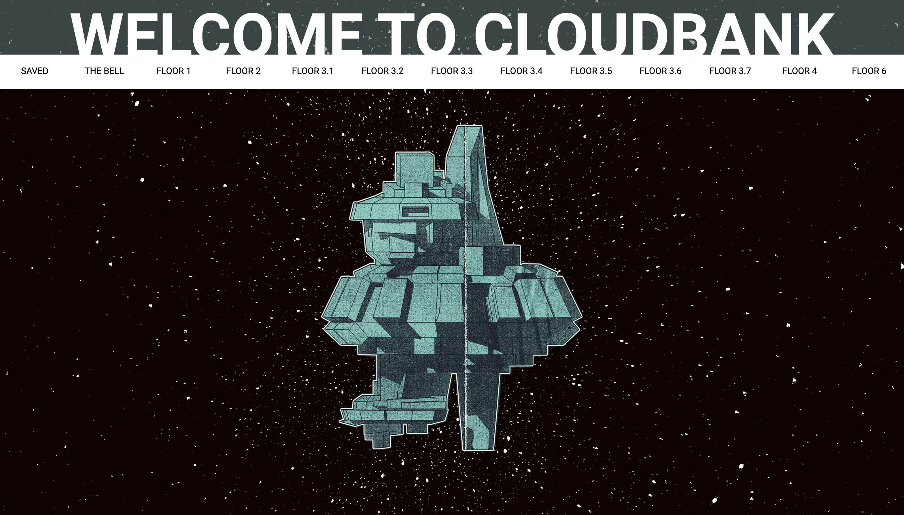
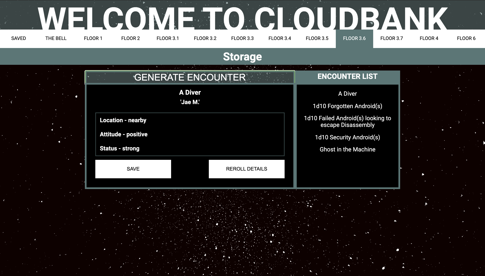
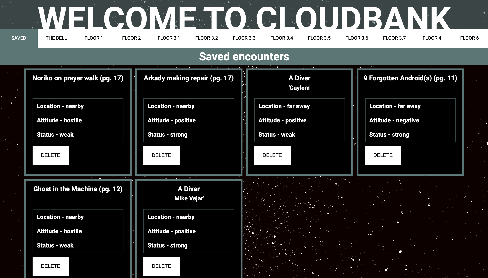
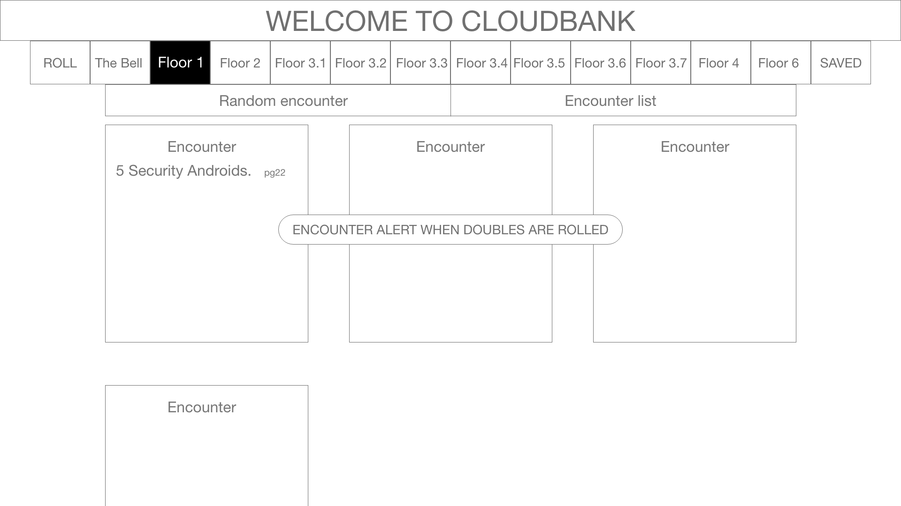
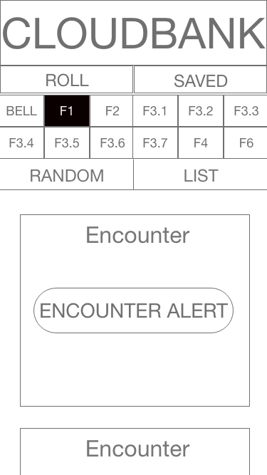
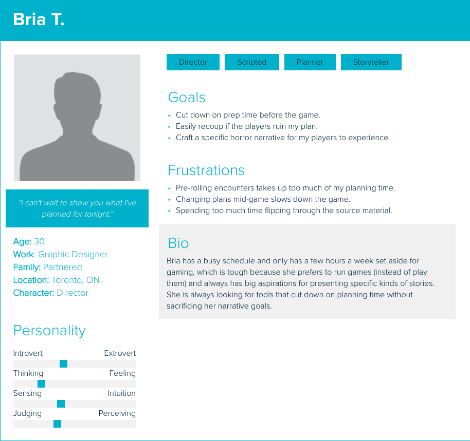
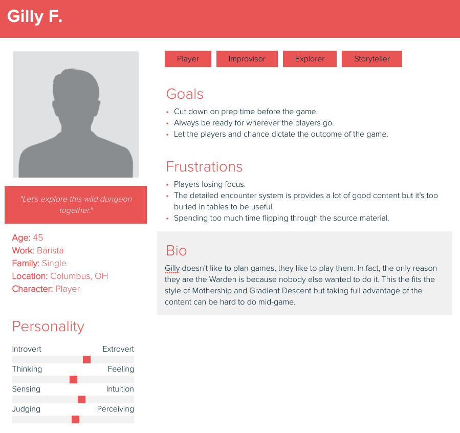
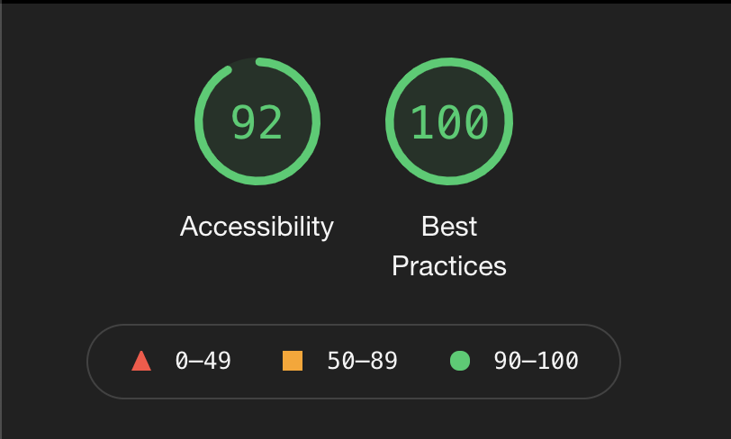

# Cloudbank

## About the Project

In this project, I was tasked with creating an app for a niche audience. I chose to create an app for people who run the Mothership Sci-Fi Horror Role Playing Game (aka ‘Wardens’) AND use the Gradient Descent mega-dungeon module AND use a computer when they play. Because this project used a combination of fetched and local data, it provided an excellent opportunity to practice "Data down, actions up". When an encounter was created, it combined data from multiple sources, some of which were randomly determined. To ensure that everything rendered from a stable location, I always sent newly generated encounters up to the state in app, before passing it back down through the tree of components to be rendered.

All random names are provided by the Star Trek API
http://stapi.co/

Project spec ->
https://frontend.turing.edu/projects/module-3/niche-audience.html

#### Final Product:
##### Landing Page:

##### Floor Page:

##### Saved Encounter Page:

## Project Goals
1. Create multipage app using Router.
2. Make network requests to API endpoints to retrieve and manipulate data.
3. Use Object Oriented Programming (OOP) to drive the design of the application and the code.
4. Create a test suite using Cypress that thoroughly tests all the functional aspects of the application.
5. Ensure the app is following best accessibility practices.
6. Leverage SASS to DRY up CSS.
7. Make the app responsive so that content can be viewed on all devices.

## Installation
1. Clone down this repo.
2. Install dependencies in the root directory with `npm install`
3. Once inside the project directory, run `npm start` to boot up the development server and see the app.

## Technologies Used

- 

- 

- 

- 

- 

- 

- 

## Wireframes
Low fidelity wireframes allowed me to map out the user flow.

## User Personas
The highly focused nature of the audience allowed for me to assume familiarity with the content. To ensure that I was meeting as wide an audience as possible within the niche group, I created two different user personas.

## Functionality

#### Landing Page
The landing page features an image of the setting of the source material, the Cloudbank Synthenic Production Facility. I was able to use React Router to also use this page as a way to display error messages.

#### Floor page
Clicking on any of the tabs within the header, sends the user to a page for one of the 12 floors of the facility. From here, users can see a list of all possible encounters, randomly roll an encounter and save an encounter.

#### Saved View
This page allows users to view a grid of all their saved encounters and delete any saved encounters.

#### Error Handling
Error handling was considered when building the website. Errors related to fetching random names are handled by replacing any bad responses with a default name.

#### Responsiveness

#### Accessibility
Cloudbank received a 92% from Lighthouse on Accessibility. Users can tab throughout the full application, making it accessible for those using keyboards to navigate through.

## Contact the Contributers
[][linkedin2]
[][github2]

<!-- Personal Definitions  -->
[linkedin2]: https://www.linkedin.com/in/matt-umland-he-him-4264455b/
[github2]: https://github.com/mattumland
